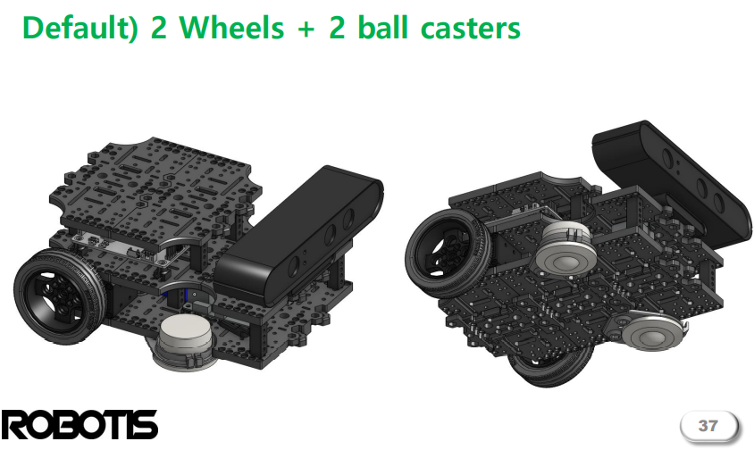

# TSR-2023-1-T1

Entrega de la tarea 1 de la asignatura.

Practica de documentación en Markdown

## Contenido

- [TSR-2023-1-T1](#tsr-2023-1-t1)
  - [Contenido](#contenido)
  - [Introducción](#introducción)
  - [Desarrollo](#desarrollo)
    - [Clasificación de los robots móviles por configuración](#clasificación-de-los-robots-móviles-por-configuración)
    - [Restricciones cinemáticas](#restricciones-cinemáticas)
    - [Conceptos de localización, ruta, odometría y planeación de ruta](#conceptos-de-localización-ruta-odometría-y-planeación-de-ruta)
    - [Diferencias entre sistemas holonómicos y no-honolomicos](#diferencias-entre-sistemas-holonómicos-y-no-honolomicos)
    - [Caracterización de la plataforma móvil TurtleBot3](#caracterización-de-la-plataforma-móvil-turtlebot3)
  - [Conclusiones](#conclusiones)
  - [Autor](#autor)
  - [Referencias](#referencias)

## Introducción

los Robots móviles representan una configuración de los robots de servicio, a continuación se desarrolla una investigación sobre conceptos básicos de estos robots.

## Desarrollo

### Clasificación de los robots móviles por configuración

Existen 4 ptincipales configuraciones para la moviliodad de un robot y son las siguientes:

- Diferencial:
   Es el sistema utilizado por tanques militares, se tienen dos motores para el robot, mediante el giro de estos se obtiene el movimiento del robot.
- Automóvil:

  Análoga a la utilizada por automóviles, emplea un motor de tracción y otro de dirección.
- Triciclo:
  
  Utiliza dos motores para tracción y dirección, la estabilidad del motor se logra con ruedas locas.
- Omnidireccional:
  Sistema de movimiento complejo, en el que las llantas pueden generar movimientos en cualquier dirección del robot.

### Restricciones cinemáticas

>se define el concepto de restricción cinemática entre dos cuerpos, como las
condiciones impuestas sobre el movimiento relativo de ambos. Se indica que cuando esas
condiciones están expresadas mediante ecuaciones algebraicas en términos de las
coordenadas generalizadas, reciben el nombre de ecuaciones de restricción cinemáticas
holonómicas, y se indica la forma de representarlas[^1].

Las coordenadas dependientes son coordenadas que se utilizan para representar el sistema de manera unequívoca, se relacionan con las coordenadas independientes mediante las restricciones cinemáticas.

### Conceptos de localización, ruta, odometría y planeación de ruta

Localización:
se entiende como localización a la detección de la posición de un robot respecto a su medio ambiente, utilizando la información sobre el entorno recogida por el robot.

Ruta:
En robótica, el problema de planeación de rutas se define así:
>Dado un robot, un espacio de trabajo, una configuración inical y una configuración final, se desea encontrar una ruta libre de colisión para el robot, de la configuración inicial a la configuración final, si ésta existe. En caso contrario, determinar que dicha ruta no existe.[^2]

### Diferencias entre sistemas holonómicos y no-honolomicos

Se define como sistema holonomico a los robots que pueden cambiar su dirección de movimiento instantáneamente, sin necesidad de girar antes del cambio de dirección, además de esto, un robot holonómico tierne el mismo número de grados de libertad controlables y totales, mientras que un no holonómico tiene menos grados de libertad controlables que totales.
La maniobrabilidad de un sistema.

### Caracterización de la plataforma móvil TurtleBot3

- #### Modelo cinemático

dado que el robot tiene una configuración de dos ruedas, Las ecuaciones cinemáticas del punto medio del eje entre
las ruedas activas, referidas a un sistema de referencia
global son :

$x^.=v(t)cos(\theta(t))$

$y^.=v(t)sin(\theta(t))$

$\theta^.(t)=\omega(t)$

- #### Sensores y actuadores que lo integran

  - Batería LiPo 11.1v 1800 mAh
  - OpenCR para ROS embebido
  - Motores Dynamixel-X series (XL430 o XM430)
  - sensor de distancia láser LDS-01
  - SBC

- #### Nodos y Tópicos de ROS utilizados por la plataforma Turtlebot3 y sus sensores

  - Topicos
    - clicked_point
    - cmd_vel
    - initialpose
    - joint_states
    - move_base_simple/goal
    - odom
    - rosout
    - rosout_agg
    - tf
    - tf_static
  
  - Nodos
  
    - robot_state_publisher
    - rosout
    - rviz
    - turtlebot3_fake_node

## Conclusiones

Los robots móviles tienen diversas configuraciones, todas con diversas aplicaciones y por consiguiente diferente modelado, y restricciones cinemáticas.

Por otra parte, los problemas elementales de la robótica son la localización, odometría y plaeación de ruta.

Un ejemplo de robot móvil es el turtlebot3, que utiliza diversos temas y nodos en ROS para su funcionamiento, así como sensores y hardware necesario para los problemas elementales mencionados.

## Autor  

Sanchez Espinosa Miguel Angel [GitHub profile](https://github.com/MigSE)

## Referencias

[1] B. G., «ROBOTS MÓVILES Teoría, aplicaciones y Experiencias,» 2002. [En línea]. Available: <https://core.ac.uk/download/pdf/229164924.pdf>.

[2] J. Oliver, «M4 – Análisis Computacional de Mecanismos Planos,» 2014. [En línea]. Available: <http://www.upv.es/vltmodels/v2019/C07/07-07-DEFINICION-RESTRICCIONES.pdf>.

[3] A. Fernandez, «Máquinas y Mecanismos,» [En línea]. Available: <https://ocw.unican.es/pluginfile.php/2949/course/section/2799/Tema%207%20-%20Ana%CC%81lisis%20Cinema%CC%81tico%20III.pdf>.

[4] K. Ramírez, «Localización,» [En línea]. Available: <http://www.kramirez.net/Robotica/Material/Presentaciones/Localizacion.pdf>.

[5] «Capítulo 4 ¨planeación de Rutas,» [En línea]. Available: <http://catarina.udlap.mx/u_dl_a/tales/documentos/lis/munoz_r_o/capitulo4.pdf>.

[6] «Sistemas holonómicos,» 16 07 2017. [En línea]. Available: <http://blog.electricbricks.com/2010/07/sistemas-holonomicos/>.

[7] J. Valencia, «MODELO CINEMÁTICO DE UN ROBOT MÓVIL TIPO DIFERENCIAL Y NAVEGACIÓN,» 05 2009. [En línea]. Available: <https://www.google.com.mx/url?sa=t&rct=j&q=&esrc=s&source=web&cd=&ved=2ahUKEwjN7PL94JX6AhXHDEQIHXgiBj4QFnoECFQQAQ&url=https%3A%2F%2Fdialnet.unirioja.es%2Fdescarga%2Farticulo%2F4729008.pdf&usg=AOvVaw2iqF3j2MbTFmSFVlKn_s82>.
